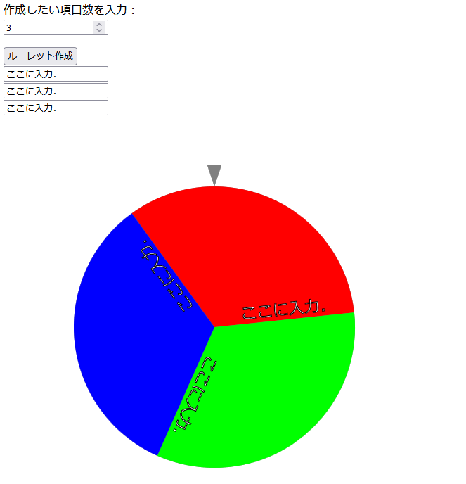

# simple_roulette
Simple roulette with JavaScript

## 使用方法
1. simple_roulette.htmlをWebブラウザで開く。

2. 作成したい項目数を入力する。

3. 「ここに入力」の欄にルーレットの各項目に入力したい文字列を入力する。

4. 「ルーレット作成」をクリックする。ルーレットが作成されます。

5. ルーレットをクリックし、ルーレットを回す。再度ルーレットをクリックするとルーレットが止まります。

## 画面イメージ

## 補足
「se」フォルダに「stop_roulette.mp3」という名前でmp3ファイルを置くと、ルーレットを止めたときにその音声ファイルが流れます。
